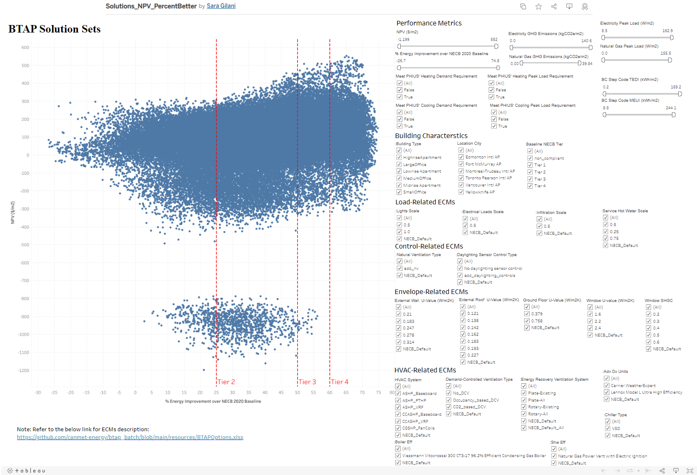

# BTAP

## Background
BTAP allows you to quickly generate archetype buildings based on Canadian codes and data and apply common energy 
conservation measures to explore possible technology packages. BTAP calculates energy, NECB Tier performance,  
operational carbon and relative capital costs for all scenarios where possible. 

Some unique features of BTAP:
* NECB Rulesets are built in to allow quick generation of NECB models for all locations and NaturalGas, Electricity and HP baseline systems.
* Dynamic Costing that automatically accounts for load/sizing change costs for heating and cooling equipment.  Using RSMeans 2020 data. 
* Operational GHG accounting using rate from [Portolio Manager 2020](https://github.com/NREL/openstudio-standards/blob/master/lib/openstudio-standards/standards/necb/common/btap_data.rb#L1899)
* Utility Costs using Canada Energy Board 2021 [rates](https://github.com/NREL/openstudio-standards/blob/master/lib/openstudio-standards/standards/necb/common/neb_end_use_prices.csv).

The most common used cases for BTAP is to:
* quickly generate NECB archetypes for 2011 through 2020 for any building type and location.
* examine the cost/performance of the National Energy Code for buildings in all location in Canada.
* examine cost-effective design pathways to high performance buildings.

BTAP Data can be used to generate dashboards. For example this [dashboard](https://public.tableau.com/app/profile/sara.gilani/viz/Solutions_NPV_PercentBetter/DB_Solutions_NPV_PercentBetter) was developed doing a series of BTAP Batch analyses.


## Costing
BTAP will automatically cost most relevant materials, equipment and labour. BTAP Costing will only cost items that have energy impact. It will for example cost the wall construction layers, but not the structural components. 
Some items that BTAP costs are:
* Labour, Overhead
* Layer Materials in Constructions and fenestration.
* Piping, Ductworks, Headers based on actual geometry of the building. This is required when evaluating forces air vs hydronic solutions. 
* Standard HVAC Equipment, Boilers, Chillers, HeatPumps, Service Hot Water. 

Some examples of items it will not cost are:
* Internal walls, doors, toilets, structural beams, furniture, etc.   

For costing, BTAP uses the National Energy Board Utility [rates](resources/ceb_fuel_end_use_prices.csv). These are averaged costs per GJ and do not have block or tiered surcharges. Equipment and materials costing requires a licence for RSMeans. Please contact RSMeans for a licence if you wish to use their data. We are currently using RSMean 2020 data in btap. 

## Interface
BTAP Batch has a command line interface.  You can use the (help) -h switch to reveal all the commands. Here is an example of the help output.
```bash
(venv) PS C:\btap_batch> python ./bin/btap_batch.py -h    
Usage: btap_batch.py [OPTIONS] COMMAND [ARGS]...

Options:
  --version   Show the version and exit.
  -h, --help  Show this message and exit.

Commands:
  aws-download  Download results from 1 or more analyses performed on...
  aws-kill      This will terminate all aws analyses.
  aws-rm-build  This delete all resources on aws for the given...
  batch         This will run all the analysis projects in a given folder...
  build         This will build the environment required to run an analysis.
  credits
  run           This will run an analysis project.
  run-examples  This will run all the analysis projects in the examples...
```

These commands will be made more clear in the workflow examples below. 

## Requirements
Software requirements for running btap_batch can be found [here](docs/requirements.md)

## Download/Update Source Code and Python Packages
Instructions for downloading btap_batch from github and installing supporting Python packages are [here](docs/download.md)

## Configuring BTAP Batch
Instructions for configuring your btap_batch and creating a build environment can be found [here](docs/configure.md)

## Building Type Geometries
BTAP has a array of pre-developed building geometries for building types. These models already have full geometries and 
space types assigned to spaces. So you can use these immediately for analysis. However, you can also create your own 
building type geometry and space type assignments.  More inforation on geometries is [here](docs/geometry_library.md)

## Analysis Workflow Examples
 * [Optimization](docs/optimization.md): Run a genetic optimization for a fixed number of runs and generations based. 
 * [Parametric](docs/parametric.md): Run all possible combinations in input file.
 * [Elimination](docs/elimination.md): Examine theoretical maximum energy savings from each domain for a given model. 
 * [Sensitivity](docs/sensitivity.md): Examine the energy and cost effect from each measure selected. (~100 measures) 
 * [Latin-Hypercube-Sampling](docs/latin_hypercube_sampling.md): Sample the solution space with a given number of simulations
 * [Batch](docs/packages.md): When you wish to simply run a few specific building scenarios for comparison.


# Troubleshooting / FAQ
 [Troubleshooting/FAQ](docs/troubleshooting.md)

# Known Issues
[Issues](docs/known_issues.md)


